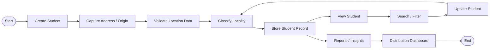

# V02 — Student Locality & Geographic Classification

> **A student geographic classification and distribution dashboard for accreditation, institutional reporting, and outreach analysis.**


---

## 📌 Overview

Institutions need to understand and report the geographic spread of their student population for **accreditation, institutional planning, outreach analysis, and reporting**.

This project provides a **Student Locality & Geographic Classification Module** that uses a student's address/origin information and the institution's location to automatically classify students into five geographic categories:

* 🟢 **Local**
* 🔵 **District**
* 🟡 **Within State**
* 🟠 **Other State**
* 🟣 **International**

The system also provides a **distribution dashboard** that summarizes the number and percentage of students in each category.

---

## 🎯 Business / Accreditation Requirement

Institutions must be able to report the geographic spread of their student body across:

**Local → District → State → Other State → International**

This information can support:

* Accreditation reporting
* Institutional analysis
* Student demographic analysis
* Outreach planning
* Admission strategy
* Regional representation analysis

---

# 🚀 MVP Objective

Build a student geographic classification module that:

1. Stores student address/origin information.
2. Uses the institution's location as the reference point.
3. Determines the student's locality category.
4. Displays the classification when viewing a student.
5. Allows students to be searched and filtered.
6. Provides a distribution dashboard.
7. Ensures dashboard totals match the underlying student records.

---

# 🗂️ Locality Classification Logic

The classification is determined using the student's **city/locality, district, state, and country** compared against the institution's corresponding location.

| Category         | Classification Rule                                        |
| ---------------- | ---------------------------------------------------------- |
| 🟢 Local         | Student is from the same locality/city as the institution  |
| 🔵 District      | Student is from the same district but a different locality |
| 🟡 Within State  | Student is from a different district but the same state    |
| 🟠 Other State   | Student is from a different state within the same country  |
| 🟣 International | Student is from a different country                        |

### Example

If the institution is located in:

> **Mangaluru, Dakshina Kannada, Karnataka, India**

Then:

| Student Origin                                | Category      |
| --------------------------------------------- | ------------- |
| Mangaluru, Dakshina Kannada, Karnataka, India | Local         |
| Puttur, Dakshina Kannada, Karnataka, India    | District      |
| Udupi, Udupi, Karnataka, India                | Within State  |
| Kochi, Ernakulam, Kerala, India               | Other State   |
| Dubai, UAE                                    | International |

---

# 📊 Data Requirements

The system captures the following information:

| Field             | Description                       |
| ----------------- | --------------------------------- |
| Student ID        | Unique student identifier         |
| Student Name      | Student's name                    |
| Address           | Full address/origin details       |
| Locality / City   | Student's locality                |
| District          | Student's district                |
| State             | Student's state                   |
| Country           | Student's country                 |
| Locality Category | Automatically determined category |

The system also stores the **home institution location** used as the reference point for classification.

---

# 🧭 Required UI Flow


### Complete Application Flow



---

# 🖥️ UI Design

The MVP contains the following major screens:

## 1. Student List

The student list allows users to:

* View all students
* Search students
* Filter by locality category
* Open individual student records
* View classification status

```text
┌─────────────────────────────────────────────────────────────┐
│                 STUDENT LOCALITY SYSTEM                     │
├─────────────────────────────────────────────────────────────┤
│ Search Student: [________________]  Category: [All ▼]       │
├───────────┬────────────────┬──────────────┬─────────────────┤
│ Student ID│ Student Name   │ State        │
```
